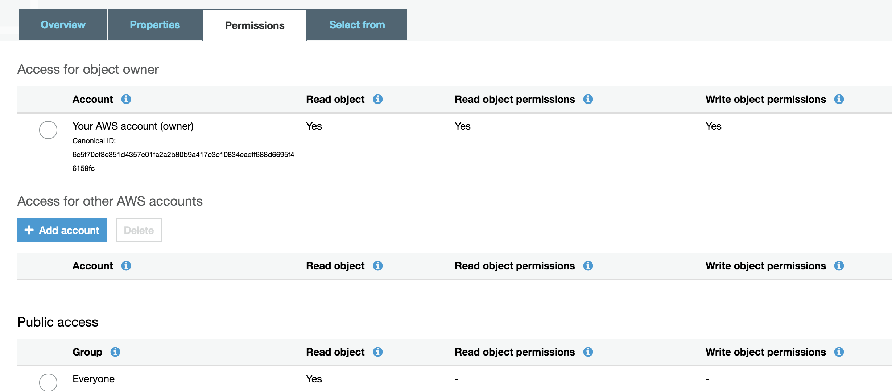

= Lab 2: Deploy the container using EKS

=== Introduction

In this module, we're going to deploy applications using http://aws.amazon.com/eks/[Amazon Elastic Container Service for Kubernetes (Amazon EKS)].

==== Getting Started with Amazon Elastic Container Service for Kubernetes (EKS)

Before we get started, here are some terms you need to understand in order to
deploy your application when creating your first Amazon EKS cluster.

[options="header"]
|=======================
| Object | Cluster
| Cluster | A group of EC2 instances that are all running `kubelet` which
connects into the master control plane.
| Deployment | Configuration file that declares how a container should be
deployed including how many `replicas` what the `port` mapping should be and how
it is `labeled`.
| Service | Configuration file that declares the ingress into the container,
these can be used to create Load Balancers automatically.
|=======================

===== Amazon EKS and Kubernetes Manifests

To use Amazon EKS or any Kubernetes cluster you must write a manifest or a
config file, these config files are used to declaritively document what is
needed to deploy an individual application. More information can be found
https://kubernetes.io/docs/concepts/workloads/controllers/deployment/[here]

1. Switch to the tab where you have your Cloud9 environment opened.

2. In Cloud9 `cd` into the module directory.
+
[source,shell]
----
cd ~/environment/containers-sydsummit-eks-workshop-2019/amazon-ecs-mythicalmysfits-workshop/Kubernetes/mono
----
+
3. Open the *monolith-app.yaml* file by double clicking the filename
in the lefthand navigation in Cloud9.

4. The file has the following contents:
+
.monolith-app.yaml
[source,yaml]
----
apiVersion: apps/v1
kind: Deployment
metadata:
  name: mythical-mysfits-eks
  labels:
    app: mythical-mysfits-eks
spec:
  replicas: 2
  selector:
    matchLabels:
      app: mythical-mysfits-eks
  template:
    metadata:
      labels:
        app: mythical-mysfits-eks
    spec:
      containers:
        - name: mythical-mysfits-eks
          image: *<YourAccountID>*.dkr.ecr.us-west-2.amazonaws.com/mythic-mono-XXX:latest
          imagePullPolicy: Always
          ports:
            - containerPort: 80
              protocol: TCP
          env:
            - name: DDB_TABLE_NAME
              value: REPLACE_YOUR_DDB_TABLENAME
            - name: AWS_DEFAULT_REGION
              value: us-west-2
---
apiVersion: v1
kind: Service
metadata:
  name: mythical-mysfits-eks
spec:
  type: LoadBalancer
  selector:
    app: mythical-mysfits-eks
  ports:
   -  protocol: TCP
      port: 80
      targetPort: 80 
----
+

5. Replace the ENV variable with image value with the exact ECR IMAGE URI that you built in the previous lab for your monolith image and also update your DynamoDB Tablename (e.g. Table-mythical-mysfits-eks).

6. Within the IAM console, open the EKS node group role (IAM role with 'eksctl-mythicalmysfits-nodegroup' prefix) and add the AWS-managed policy `AmazonDynamoDBFullAccess`.

7. Apply your manifest by running this command in your Cloud9 terminal:
+
[source,shell]
----
kubectl apply -f monolith-app.yaml
----
+
[.output]
....
deployment.apps/mythical-mysfits-eks created
service/mythical-mysfits-eks created
....
+
8. As you can see above this manifest created and configured 1 deployment and 1 service for your monolith app..
+
[options="header"]
|=======================
| Primitive | Description
| *Namespace* | Namespaces are meant to be virtual clusters within a larger
pysical cluster.
| *PersistentValue* | Persistent Volume (PV) is a piece of storage that has been
provisioned by an administrator. _These are cluster wide resources._
| *PersistentVolumeClaim* | Persistent Volume Claim (PVC) is a request for storage
by a user.
| *Service* | Service is an abstraction which defines a logical set of Pods
and a policy by which to access them.
| *Deployment* | Deployment controller provides declarative updates for Pods and
ReplicaSets.
|=======================
+
9. Now that the scheduler knows that you want to run this application it will
   find available *disk*, *cpu* and *memory* and will place the jobs. Let's
   watch as they get provisioned.
+
[source,shell]
----
kubectl get pods --watch
----
+
[.output]
....
AME                                       READY     STATUS    RESTARTS   AGE
mythical-mysfits-eks-7c8d764676-2zhfd      1/1       Running   0          21s
mythical-mysfits-eks-7c8d764676-hrs85      1/1       Running   0          21s
....
+
10. Once the *STATUS* changes to *Running* for  your container we can
   then load the services and navigate to the exposed application (you will
   need to ctrl-c since its watching).
+
[source,shell]
----
kubectl get services -o wide
----
+
[.output]
....
NAME                      TYPE           CLUSTER-IP       EXTERNAL-IP                                 
mythical-mysfits-eks      LoadBalancer   10.100.159.2     aea2e66c759f711e994690e7be669691-645977634.us-west-2.elb.amazonaws.com  
PORT(S)        AGE       SELECTOR 
80:32016/TCP   1m        app=mythical-mysfits-eks 
....
+
11. Here we can see that we're exposing the *frontend* using an ELB which is
   available at the *EXTERNAL-IP* field. Copy and paste this into a new browser
   tab.

12. Issue a curl command
+
[source,shell]
----
ELB=$(kubectl get service mythical-mysfits-eks -o json | jq -r '.status.loadBalancer.ingress[].hostname')
curl -m3 -v $ELB
----
+
[.output]
....
* Rebuilt URL to: aea2e66c759f711e994690e7be669691-645977634.us-west-2.elb.amazonaws.com/ 
  *   Trying 34.216.204.210...   

* TCP_NODELAY set                                                                                                                                              
* Connected to aea2e66c759f711e994690e7be669691-645977634.us-west-2.elb.amazonaws.com (34.216.204.210) port 80 (#0) 
> GET / HTTP/1.1                                                                                                                                               
> Host: aea2e66c759f711e994690e7be669691-645977634.us-west-2.elb.amazonaws.com    
> User-Agent: curl/7.61.1                     
> Accept: */*                                                                                                                                            
* HTTP 1.0, assume close after body                                                                                                                            
< HTTP/1.0 200 OK       
< Content-Type: application/json                                                                                       Access-Control-Allow-Origin:                                                                                              
< Content-Length: 78     
< Server: Werkzeug/0.15.2Python/2.7.15rc1                                                                                                                     
< Date: Mon, 08 Apr 2019 12:19:02 GMT 
"message": "Nothing here, used for health check. Try /mysfits instead." 

* Closing connection 0                               
....
+

13. if you see the text saying, *nothing to see here, try /mysfits*, then your pod/container is up and running. Do a curl again and append /mysfits after the previous curl command. You should see the output from the DynamoDB table. 

14. Navigate to *cd /home/ec2-user/environment/containers-sydsummit-eks-workshop-2019/amazon-ecs-mythicalmysfits-workshop/workshop-1/web* 

15. Take the ELB URL and search for *"mysfitsApiEndpoint"* in the *index.html* file and replace the ELB DNS name *without* any trailing "/". So it should be like:
+
....
 "http://a72403c1a586111e994690e7be669691-148203215.us-west-2.elb.amazonaws.com"
....
+

16. Now upload this new file to S3. Make sure you are in this directory: /home/ec2-user/environment/containers-sydsummit-eks-workshop-2019/amazon-ecs-mythicalmysfits-workshop/workshop-1/web
```
aws s3 ls
```
Note the bucket name where your index.html file is and copy your new index.html granting read permissions to everyone and full access to you (give your account email)
```
aws s3 cp index.html s3://-mythicalbucket-xxx/ --grants read=uri=http://acs.amazonaws.com/groups/global/AllUsers full=emailaddress=user@example.com
```



Note: Your bucket name will be different. If the email address doesn't work, go to S3 console and give yourself full access to the file

17. now go and see your S3 website, it would have the URL format like: http://BUCKET_NAME.s3-website.us-west-2.amazonaws.com/

For e.g. http://mythical-mysfits-eks-mythicalbucket-6b9pvvt40bqj.s3-website.us-west-2.amazonaws.com/

if you see all the mythical mysfits show up now, SUCCESS!! First hurdle done

Now Delete your deployment (verify by going to the console and checking ELB is deleted)
```
$ kubectl delete -f monolith-app.yaml           

Output will be as below.

deployment.apps "mythical-mysfits-eks" deleted    
service "mythical-mysfits-eks" deleted  
```                                                                                      

### Checkpoint:
Nice work!  You've created a kubernetes service and used a deployment the monolith container using ECS.  

*Now that we have our containers deployed to Amazon EKS we can continue with the workshop. You can start link:Lab3.md[lab 3] or go link:README.md[back] to the main page and start lab 3 from there.*
